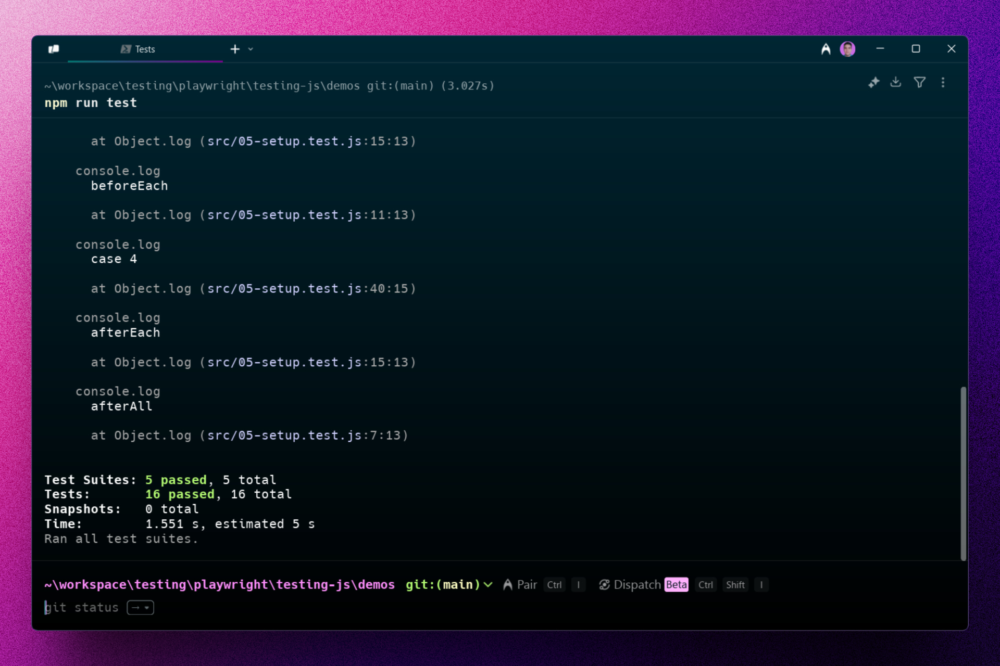
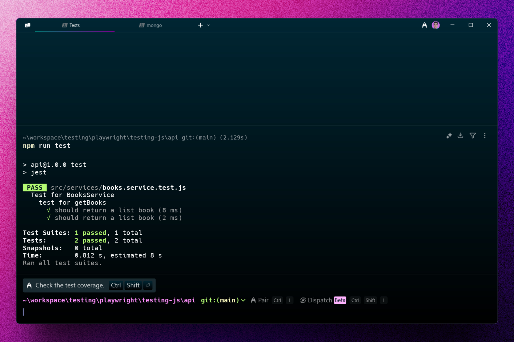
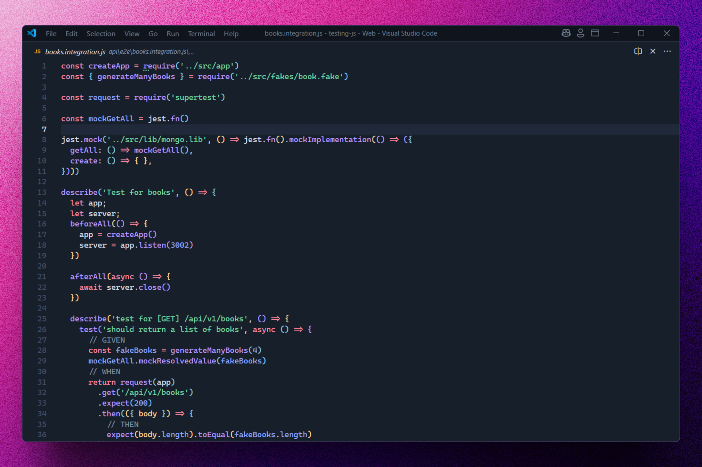

<div align='center'>

# 🧪 Jest + Playwright + MongoDB + Docker: Testing JS

</div>

### Curso completado para aprender Testing en JS.







## 🚀 Descripción

Este repositorio contiene todo el código del curso que he completado para aprender testing en JavaScript con Jest y Playwright.

Haciendo tests unitarios, de integración y e2e. Todo esto con una BDD de pruebas hecha con MongoDB y ejecutada en Docker.

## ⚡ Comenzar

### Prerrequisitos

1. Git.
2. Node.js: cualquier versión a partir de la 18 o superior.
3. Docker Desktop.

## 🔧 Instalación

### Usando npm

1. **Clona el repositorio:**

   ```bash
   git clone https://github.com/abrahamgalue/testing-js.git
   cd testing-js
   ```

2. **Instala las dependencias:**

   ```bash
   npm install
   ```

### Ejecución de tests

Puedes acceder a las diferentes carpetas y ejecutar los tests

1. **Ejecuta los tests:**

   ```bash
   npm run test
   ```

   Te recomiendo revisar los archivos `package.json` de las diferentes carpetas para revisar los diferentes scripts para ejecutar los test.

   > Nota: las carpetas que contengan un archivo `docker-compose.yml`, necesitas ejecutar ese contenedor antes de ejecutar los tests, esto lo puedes hacer con el comando `docker-compose up -d mongo-e2e` y para detener ese contenedor en la misma ruta ejecutas `docker-compose down`. Asegúrate de tener el Docker Desktop ejecutándose.

## 🎭 Tecnologías

- [**Jest**](https://jestjs.io/) Para realizar pruebas unitarias y de integración.
- [**Playwright**](https://playwright.dev/) Para realizar pruebas e2e.
- [**MongoDB**](https://www.mongodb.com/) Para crear la BDD de pruebas.
- [**Docker**](https://www.docker.com/) Para ejecutar la BDD.
- [**supertest**](https://www.npmjs.com/package/supertestS) Para generar tests de nuestra API.
- [**Faker**](https://www.npmjs.com/package/@faker-js/faker) Para hacer mocking de datos.
